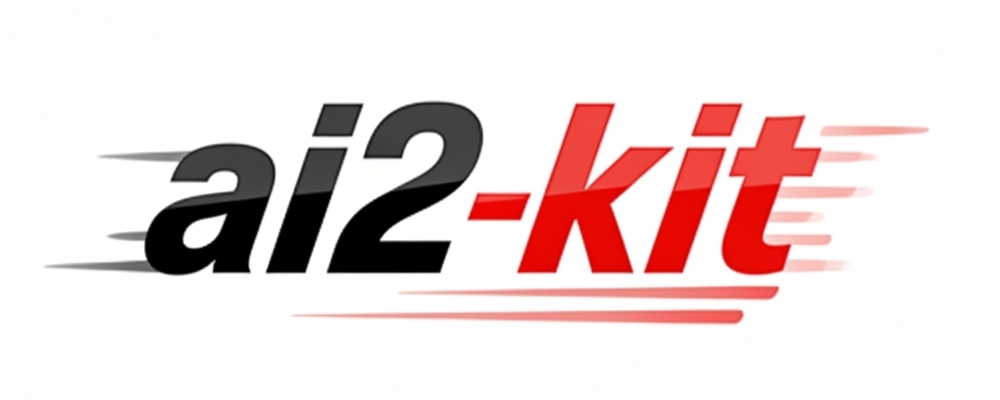

[](https://badge.fury.io/py/ai2-kit)
[](https://pypi.org/project/ai2-kit/)
[](https://pypi.org/project/ai2-kit/)
[](https://doi.org/10.5281/zenodo.15266041)
[](https://deepwiki.com/chenggroup/ai2-kit)


<p align="center">  </p>

`ai2-kit` (pronounced as "AI Squared Kit")  is a command line and python toolkit featured _**a**rtificial **i**ntelligence × **a**b **i**nitio_ for complex chemistry systems research.

*Please be advised that `ai2-kit` is still under heavy development and you should expect things to change often. We encourage people to play and explore with `ai2-kit`, and stay tuned with us for more features to come.*


## Feature Highlights
* Collection of tools to facilitate the development of automated workflows for computational chemistry research.
* Use with [oh-my-batch](https://github.com/link89/oh-my-batch) to build your own workflow with shell script.

## Environment Requirements

`ai2-kit` is developed and tested on Linux systems, and it should work on macOS as well.
For Windows, most of the `ai2-kit` features are expected to work. However, some third-party libraries (such as *dscribe*) may not function properly on Windows. 
In such cases, it is recommended to use `ai2-kit` through Windows Subsystem for Linux (WSL).

If you are using the latest version of Python, some third-party libraries may not yet provide pre-built binary releases, 
which can cause `pip install` to fail. It is therefore suggested to use `ai2-kit` with Python 3.10–3.12.
We strongly recommend creating a dedicated Conda environment to avoid unexpected issues caused by incompatible package versions.

## Installation

You can use the following command to install `ai2-kit`:

```bash
# for users who just use most common features
pip install ai2-kit

# for users who want to use all features
pip install ai2-kit[all]
```

If you want to run `ai2-kit` from source, you can run the following commands in the project folder:

```bash
pip install poetry
# If you meet ConnectionError, you can try to set the max-workers to a smaller number, e.g
# poetry config installer.max-workers 4
poetry install
poetry run ai2-kit
```

## Usage
All `ai2-kit` commands can be accessed via the command line interface `ai2-kit`.
You can run the following command to see the available commands and sub-commands:

```bash
ai2-kit
# e.g.
ai2-kit tool
ai2-kit tool dpdata

```
For detailed usage of each command, you can run the following command to view the help information:

```bash
ai2-kit <sub-command> --help
# e.g.
ai2-kit tool dpdata read --help
```

## Manuals
### Featuring Tools
* [NMRNet](doc/manual/nmrnet.md): A toolkit for predict NMR with deep learning network.
* [Proton Transfer Analysis Toolkit](doc/manual/proton-transfer.md)
* [Amorphous Oxides Structure Analysis Toolkit](doc/manual/aos-analysis.md)
* [Re-weighting Toolkit](doc/manual/reweighting.md)
* [ai2-cat](doc/manual/ai2cat.md): A toolkit for dynamic catalysis researching.

### Workflows
#### Example Driven Workflows (Recommended)
These workflows are built with [oh-my-batch](https://github.com/link89/oh-my-batch) and example shell scripts, which can be easily adapted to your own research purpose.
It provides more flexibility and transparency to run and customize their own workflows.

* [TESLA](./example/use-case/tesla/): A customizable active learning workflow for training machine learning potentials.
* [TESLA PIMD](./example/use-case/tesla-pimd/): A customizable active learning workflow for training machine learning potentials with path integral molecular dynamics.
* [TESLA for ec-MLP](./example/use-case/tesla-for-ec-mlp/): A customizable active learning workflow for training machine learning potentials for electrolyte systems.


#### Config Driven Workflows
These workflows are driven by configuration files, which can be easily modified to fit your own research purpose. 
* [CLL MLP Training Workflow](doc/manual/cll-workflow.md) ([zh](doc/manual/cll-workflow.zh.md))

### General Tools
* [ASE Toolkit](doc/manual/ase.md): commands to process trajectory files with [ASE](https://wiki.fysik.dtu.dk/ase/)
* [DPData Toolkit](doc/manual/dpdata.md): commands to process system data with [dpdata](https://github.com/deepmodeling/dpdata/)
* [Model Deviation Toolkit](doc/manual/model-deviation.md): a toolkit to filter structures by model deviation

### Online Apps and Notebooks
* [Electrolyte Designer](https://ai4ec.ac.cn/apps/op-elyte-emulator): run electrolyte simulations with ease.
* [NMRNet Prediction](https://ai4ec.ac.cn/apps/nmrnet-predict): an online app to predict NMR chemical shifts with pre-trained NMRNet models.
* [ai2cat](notebook/ai2cat.ipynb): an interactive notebook for dynamic catalysis research.

## Tips
* [Tips](doc/manual/tips.md): useful tips for using `ai2-kit`
