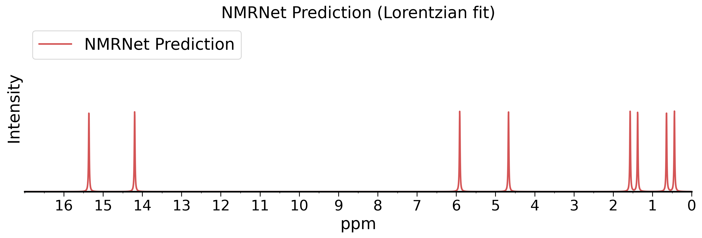

# NMRNet

```bash
ai2-kit feat nmrnet predict --help
```

[Source code](../../ai2_kit/algorithm/uninmr)

## Install extra packages

To run the NMRNet tool, you need to install extra packages besides `ai2-kit`
since the extra dependencies are too large to be included.
You can install the extra packages by running the following command:

```bash
# Install rdkit
pip install rdkit

# Install pytorch
# You can find your CUDA version from
# https://pytorch.org/get-started/previous-versions/

pip install torch==2.1.2 torchvision==0.16.2 torchaudio==2.1.2 --index-url https://download.pytorch.org/whl/cu118


# Install unicore
# You should download the version that matches your CUDA and Python from:
# https://github.com/dptech-corp/Uni-Core/releases

wget https://github.com/dptech-corp/Uni-Core/releases/download/0.0.3/unicore-0.0.1+cu118torch2.0.0-cp39-cp39-linux_x86_64.whl
pip install unicore-0.0.1+cu118torch2.0.0-cp39-cp39-linux_x86_64.whl

```

## Get started

You can find the parameters of the `predict` command by running the following command:

```bash
ai2-kit feat nmrnet predict --help
```

To run the tool, you need to prepare extra files for the following parameters:

* `model_path`: NMRNet model file.
* `dict_path`: NMRNet dictionary file.
* `saved_dir`: NMRNet saved directory, which must contain a `target_scaler.ss` file.

An example of running the tool is as follows:

```bash
ai2-kit feat nmrnet predict \
    --model_path ./weight/cv_seed_42_fold_0/checkpoint_best.pt \
    --dict_path  ./weight/oc_limit_dict.txt \
    --saved_dir  ./weight \
    --nmr_type solid --selected_atom H \
    --data_file tmp/nmr-demo.xyz
    --fig_save_to nmr.png
```

The above command will predict the NMR of the `H` atom in the `tmp/nmr-demo.xyz` file.
The prediction result will be print to stdout as the below:

```
[25.572277 29.441292 29.615028 29.896814 29.590061 30.400713 29.576017
 15.920061 29.084885 29.069242 28.565197 28.77764  28.510954 28.849863
 14.738946 24.312784]
```

Since `--fig_save_to` is specified, the prediction result will be saved to `nmr.png`.




## Citation
TODO